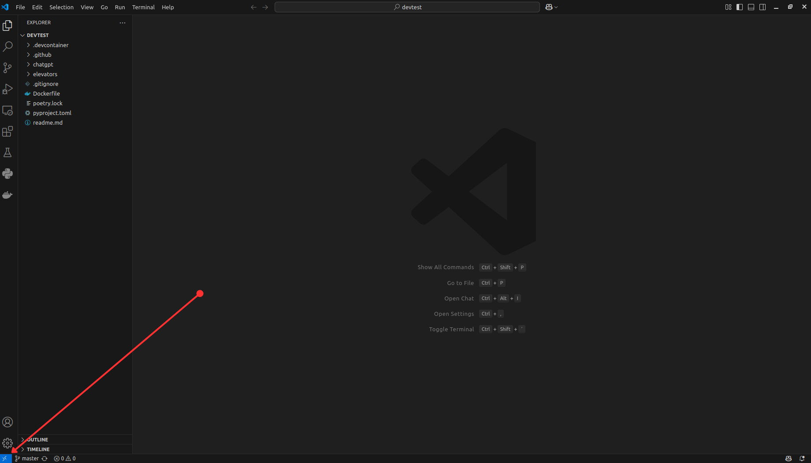

# Solution 
First, you will need to install VS Code and DevContainers. Assuming you have already installed VS Code, search for the DevContainers extension.


After that, open the repository in VS Code and click on the blue button at the bottom left.



Finally, search for "Reopen Container" or "Rebuild Container".


### If you want to create your own database, first delete the existing database elevators.db , then run:
```sh
cd elevators
sqlite3 elevators.db < database_schema.sql
```

### In the elevators folder, run the app:
```sh
uvicorn main:app
```

The application will be available at ``http://127.0.0.1:8000/docs``

# Dev Test

## Elevators
When an elevator is empty and not moving this is known as it's resting floor. 
The ideal resting floor to be positioned on depends on the likely next floor that the elevator will be called from.

We can build a prediction engine to predict the likely next floor based on historical demand, if we have the data.

The goal of this project is to model an elevator and save the data that could later be used to build a prediction engine for which floor is the best resting floor at any time
- When people call an elevator this is considered a demand
- When the elevator is vacant and not moving between floors, the current floor is considered its resting floor
- When the elevator is vacant, it can stay at the current position or move to a different floor
- The prediction model will determine what is the best floor to rest on


_The requirement isn't to complete this system but to start building a system that would feed into the training and prediction
of an ML system_

You will need to talk through your approach, how you modelled the data and why you thought that data was important, provide endpoints to collect the data and 
a means to store the data. Testing is important and will be used verify your system

## A note on AI generated code
This project isn't about writing code, AI can and will do that for you.
The next step in this process is to talk through your solution and the decisions you made to come to them. It makes for an awkward and rather boring interview reviewing chatgpt's solution.

If you use a tool to help you write code, that's fine, but we want to see _your_ thought process.

Provided under the chatgpt folder is the response you get back from chat4o. 
If your intention isn't to complete the project but to get an AI to spec it for you please, feel free to submit this instead of wasting OpenAI's server resources.


## Problem statement recap
This is a domain modeling problem to build a fit for purpose data storage with a focus on ai data ingestion
- Model the problem into a storage schema (SQL DB schema or whatever you prefer)
- CRUD some data
- Add some flair with a business rule or two
- Have the data in a suitable format to feed to a prediction training algorithm

---

#### To start
- Fork this repo and begin from there
- For your submission, PR into the main repo. We will review it, a offer any feedback and give you a pass / fail if it passes PR
- Don't spend more than 4 hours on this. Projects that pass PR are paid at the standard hourly rate

#### Marking
- You will be marked on how well your tests cover the code and how useful they would be in a prod system
- You will need to provide storage of some sort. This could be as simple as a sqlite or as complicated as a docker container with a migrations file
- Solutions will be marked against the position you are applying for, a Snr Dev will be expected to have a nearly complete solution and to have thought out the domain and built a schema to fit any issues that could arise 
A Jr. dev will be expected to provide a basic design and understand how ML systems like to ingest data


#### Trip-ups from the past
Below is a list of some things from previous submissions that haven't worked out
- Built a prediction engine
- Built a full website with bells and whistles
- Spent more than the time allowed (you won't get bonus points for creating an intricate solution, we want a fit for purpose solution)
- Overcomplicated the system mentally and failed to start
